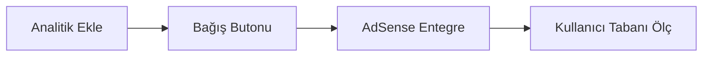

# Radyola — Monetizasyon Stratejisi

Radyola, çoklu platform (Web, Android, Linux, macOS, Windows) internet radyo çalar uygulamasıdır. Bu doküman, projenin gelir modeline dönüştürülmesi için uygulanabilir stratejileri detaylandırır.

---

## Mevcut Durum Analizi

| Özellik | Değer |
|---|---|
| **Platformlar** | Web (GitHub Pages), Android (Kotlin/Compose), Linux (.deb), macOS (Swift), Windows (.exe) |
| **İstasyon Kaynağı** | Depodaki JSON ([`data/`](../data/)), GitHub Pages'ten yayınlanır |
| **Lisans** | MIT (açık kaynak) |
| **Altyapı Maliyeti** | ~$0 (yalnızca statik hosting) |
| **Kullanıcı Tabanı** | Henüz bilinmiyor |

### Güçlü Yönler
- Sıfıra yakın sunucu maliyeti
- Çoklu platform desteği
- Hafif, hızlı, bağımlılıksız web bileşeni (`<aripd-radyola>`)
- Küratörlü istasyon listesi (niş değer) + 3.400 istasyonluk Keşfet dizini

### Zayıf Yönler
- Kullanıcı hesabı / kimlik doğrulama yok
- Analitik altyapısı yok
- Marka bilinirliği henüz düşük

---

## 1. Reklam Geliri

### 1.1 Web Uygulamasında Display Reklam

En düşük eşikli gelir modeli. Uygulamaya reklam alanları eklenir.

| Yöntem | Tahmini Gelir | Efor |
|---|---|---|
| Google AdSense banner | $1–5 / 1000 gösterim | Düşük |
| Carbon Ads (geliştirici odaklı) | $2–4 / 1000 gösterim | Düşük |
| BuySellAds | $5–15 / 1000 gösterim | Orta |

**Uygulama:**
- İstasyon listesinin üstüne veya altına ince bir banner alanı
- Player bar'ın altına küçük bir sponsor alanı
- Mobilde tam ekran geçiş reklamı (istasyon değiştirirken)

> **⚠️ Dikkat:** Shadow DOM kullanıldığı için AdSense scripti shadow root dışına yerleştirilmeli. Alternatif olarak, reklam alanı ana DOM'da tutulabilir.

### 1.2 Sesli Reklam (Audio Pre-roll)

İstasyon oynatılmadan önce 5–15 saniyelik sesli reklam çalınır.

- **Gelir:** $15–25 CPM (1000 dinleme başına)
- **Sağlayıcılar:** TargetSpot, AdsWizz, Triton Digital
- **Risk:** Kullanıcı deneyimini ciddi şekilde bozar; dikkatli A/B test gerekir

---

## 2. Freemium / Premium Model

Ücretsiz temel kullanım + ücretli premium özellikler.

### Ücretsiz (Free Tier)
- Tüm istasyonları dinleme
- Temel arama ve filtreleme
- Reklam destekli

### Premium ($2.99–4.99/ay veya $29.99/yıl)

| Özellik | Açıklama |
|---|---|
| **Reklamsız deneyim** | Tüm banner ve sesli reklamlar kaldırılır |
| **Favori istasyonlar** | Kişisel favori listesi (bulut senkronize) |
| **Zamanlayıcı (Sleep Timer)** | Belirli süre sonra otomatik durdurma |
| **Alarm modu** | Seçilen istasyonla uyandırma |
| **Equalizer** | Web Audio API ile bas/tiz ayarı |
| **Kayıt** | Yayını MP3 olarak kaydetme (yasal kontrol gerekir) |
| **Özel temalar** | Koyu, açık, özelleştirilebilir renkler |
| **Çapraz cihaz senkronizasyon** | Son dinlenen istasyon, ses seviyesi vb. |

**Gereksinimler:**
- Kullanıcı hesap sistemi (Firebase Auth veya Supabase)
- Ödeme altyapısı (Stripe, Paddle veya Gumroad)
- Basit bir backend (Supabase/Firebase yeterli)

---

## 3. Sponsorluk & Ortaklık

### 3.1 İstasyon Sponsorluğu

Radyo istasyonlarına "öne çıkan istasyon" veya "sponsorlu istasyon" olarak listeleme alanı satılır.

| Paket | Fiyat (aylık) | İçerik |
|---|---|---|
| **Öne Çıkan** | $50–200 | Listenin başında sabit konum, vurgulu tasarım |
| **Sponsorlu Rozet** | $25–75 | İstasyon adının yanında ⭐ sponsorlu rozeti |
| **Banner Entegrasyonu** | $100–300 | İstasyon seçildiğinde player alanında logo gösterimi |

**Hedef müşteriler:** Küçük/bağımsız radyo istasyonları, podcast platformları

### 3.2 Marka Sponsorluğu

- "Powered by [Sponsor]" player bar'da
- Belirli ülke/şehir filtrelerinde sponsor branding
- Tahmini gelir: $200–1000/ay (trafiğe bağlı)

### 3.3 Affiliate (Ortaklık) Programları

| Ortaklık | Komisyon |
|---|---|
| Müzik ekipmanı (Amazon Affiliate) | %4–8 |
| Kulaklık/hoparlör markaları | %5–10 |
| Müzik streaming servisleri (referral) | $2–10 / kayıt |
| VPN servisleri (coğrafi kısıtlamalar için) | $5–30 / kayıt |

---

## 4. B2B / White-Label Satış

Radyola'nın web bileşeni (`<aripd-radyola>`) bir Web Component olarak paketlenmiştir. Bu, ticari lisanslama için güçlü bir avantajdır.

### 4.1 Embeddable Widget Satışı

Radyo istasyonları veya medya şirketlerine özelleştirilmiş gömülebilir widget satışı.

```html
<!-- Müşteri sitesine eklenen tek satır -->
<script src="https://cdn.radyola.app/widget.js"></script>
<aripd-radyola stations="custom" theme="dark" api-key="xxx"></aripd-radyola>
```

| Paket | Fiyat | İçerik |
|---|---|---|
| **Starter** | $99/yıl | Tek istasyon, temel özelleştirme |
| **Professional** | $299/yıl | 10 istasyon, tam tema özelleştirme, analitik |
| **Enterprise** | $999/yıl | Sınırsız istasyon, özel geliştirme, SLA |

### 4.2 White-Label Uygulama

Radyo istasyonlarına kendi markalarıyla masaüstü uygulaması (Linux/Windows/macOS) satışı.

- Tek seferlik lisans: $500–2000
- Yıllık bakım: $200–500
- Hedef: Yerel radyo istasyonları, üniversite radyoları

---

## 5. Bağış & Topluluk Destekli Model

Açık kaynak projelere uygun, düşük eforlu gelir modeli.

| Platform | Tipik Gelir | Uygulama |
|---|---|---|
| [GitHub Sponsors](https://github.com/sponsors) | $50–500/ay | Profil + README badge |
| [Buy Me a Coffee](https://buymeacoffee.com) | $20–200/ay | Web uygulamasına buton ekle |
| [Open Collective](https://opencollective.com) | $100–1000/ay | Şeffaf bütçe yönetimi |
| [Patreon](https://patreon.com) | $50–500/ay | Tier bazlı ödüller |
| [Ko-fi](https://ko-fi.com) | $10–100/ay | Tek seferlik bağışlar |

**Uygulama:** Player bar'a veya footer'a küçük bir "☕ Destekle" butonu eklemek yeterli.

---

## 6. Veri & Analitik Geliri

### 6.1 Dinleme Analitiği Satışı

Radyo istasyonlarına dinleyici istatistikleri sunulur (anonim, GDPR uyumlu):

- Hangi istasyonlar ne kadar dinleniyor
- Coğrafi dağılım
- Zaman bazlı dinleme eğrileri
- Dinleyici davranış raporları

**Fiyat:** $50–200/ay (istasyon başına)

### 6.2 API Erişimi

Geliştiricilere ücretli API sunulur:

| Plan | Fiyat | Limit |
|---|---|---|
| Free | $0 | 100 istek/gün |
| Developer | $9.99/ay | 10.000 istek/gün |
| Business | $49.99/ay | Sınırsız |

---

## 7. Uygulama Mağazaları

### 7.1 Mobil Uygulama (Yeni Geliştirme)

PWA veya React Native/Flutter ile mobil uygulama çıkışı:

- **App Store / Google Play:** Ücretli uygulama ($1.99–3.99) veya uygulama içi satın alma
- **Potansiyel:** Mobil radyo dinleme pazarı çok büyük (TuneIn, Radio Garden gibi başarılı örnekler)

### 7.2 Masaüstü Mağazalar

- **Snapcraft (Linux):** Snap Store'da yayınlama
- **Microsoft Store:** Windows uygulamasını listeleme
- **Mac App Store:** macOS uygulamasını listeleme

---

## Önerilen Yol Haritası

Aşağıdaki sıralama, efor/getiri oranına göre optimize edilmiştir:

### Faz 1: Temel (0–3 ay) — $0 yatırım



1. **Web analitiği ekle** (Plausible veya Umami — gizlilik dostu, ücretsiz self-host)
2. **Bağış butonu** ekle (Buy Me a Coffee / Ko-fi)
3. **AdSense** veya Carbon Ads entegre et
4. **SEO optimizasyonu** — Meta etiketler, Open Graph, sitemap

### Faz 2: Büyüme (3–6 ay) — $0–100 yatırım

5. **PWA desteği** — Offline erişim, ana ekrana ekleme
6. **İstasyon sponsorluğu** satışına başla
7. **Affiliate linkler** ekle (kulaklık/hoparlör önerileri sayfası)
8. **Sosyal medya** varlığı oluştur

### Faz 3: Ölçekleme (6–12 ay) — $100–500 yatırım

9. **Premium model** başlat (kullanıcı hesabı + Stripe)
10. **Mobil uygulama** çıkar (PWA → Native)
11. **Widget satışı** başlat
12. **İstasyon analitiği** platformu geliştir

---

## Gelir Projeksiyonu (Tahmini)

| Kaynak | Aylık 1K Kullanıcı | Aylık 10K Kullanıcı | Aylık 100K Kullanıcı |
|---|---|---|---|
| Reklam (Display) | $5–15 | $50–150 | $500–1500 |
| Bağışlar | $10–50 | $50–200 | $200–500 |
| Premium Üyelik (%2 dönüşüm) | $60–100 | $600–1000 | $6000–10000 |
| Sponsorluk | $0 | $100–300 | $500–2000 |
| Widget/B2B | $0 | $0–300 | $1000–5000 |
| **Toplam** | **$75–165** | **$800–1950** | **$8200–19000** |

> Bu rakamlar sektör ortalamalarına dayalı tahminlerdir. Gerçek sonuçlar niş, coğrafya ve pazarlama eforununa göre değişir.

---

## Sonuç

Radyola'nın en güçlü monetizasyon avantajı **sıfıra yakın altyapı maliyeti** ve **Web Component tabanlı gömülebilir mimarisidir**. Kısa vadede bağış + reklam ile organik gelir elde edilebilirken, orta vadede B2B widget satışı ve premium model ile ölçeklenebilir bir gelir yapısı kurulabilir.

En kritik ilk adım **analitik altyapısını kurmaktır** — gelir optimize etmek için önce kullanıcı davranışını ölçmek gerekir.
